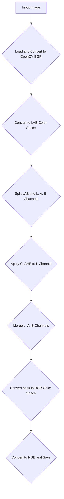

# Dark CV

A tool to enhance images taken in dark environments.

## Getting Started

### Prerequisites

- Python 3.11+
- [uv](https://github.com/astral-sh/uv) - Python Environment Manager
  - [Ruff](https://github.com/astral-sh/ruff) - Linter & Formatter
  - [ty](https://github.com/davidvujic/ty) - Type Checker
  - [pre-commit](https://pre-commit.com) - Git Hooks Manager
  - [Typer](https://typer.tiangolo.com) - CLI Framework
  - [OpenCV](https://opencv.org) - CV Library

### Installation

Create a virtual environment and install dependencies:

```bash
uv venv
uv sync
```

To activate the virtual environment, run:

```bash
source .venv/bin/activate
```

Set up pre-commit hooks:

```bash
uv run pre-commit install
```

## Current Image Processing Flow



> [!NOTE]
> **LAB Color Space**
> The LAB color space separates image color into three components: L (Lightness), A (Green-Red), and B (Blue-Yellow).
> This separation is crucial for image enhancement as it allows for the manipulation of brightness (L-channel) independently of color information (A and B channels).
> By applying contrast enhancement techniques like CLAHE only to the L-channel, the tool can improve image visibility without introducing unnatural color shifts or distortions.

> [!NOTE]
> **CLAHE (Contrast Limited Adaptive Histogram Equalization)**
> CLAHE is an advanced form of histogram equalization that operates on small regions of the image, called tiles, rather than the entire image.
> This local approach helps to enhance contrast in specific areas without over-enhancing noise or creating unnatural artifacts in other parts of the image.
> It's particularly effective for improving the visibility of details in dark or low-contrast images.
