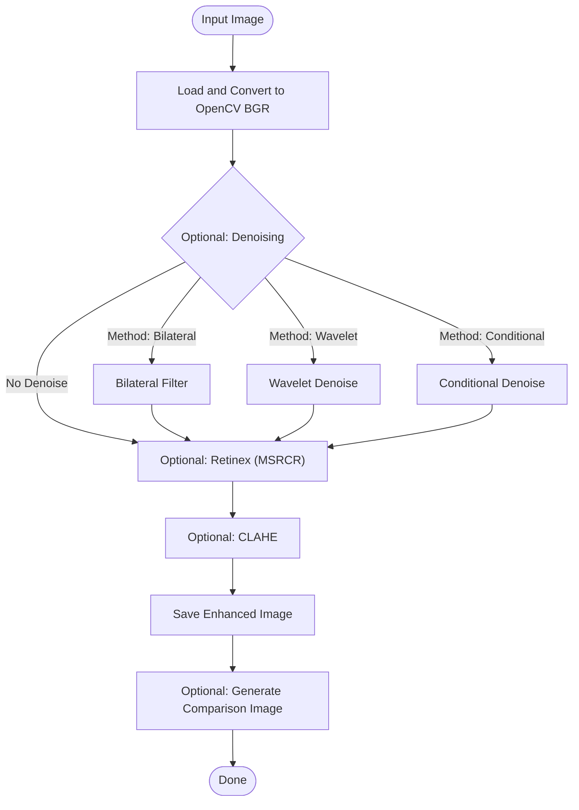

# Dark CV

A tool to enhance images taken in dark environments.

- [Examples](#examples)
- [Getting Started](#getting-started)
  - [Prerequisites](#prerequisites)
  - [Installation](#installation)
- [Usage](#usage)
  - [Options](#options)
  - [Examples](#examples-1)
  - [Output File Naming](#output-file-naming)
- [Current Image Processing Flow](#current-image-processing-flow)
- [License](#license)

## Examples


## Getting Started

### Prerequisites

- Python 3.11+
- [uv](https://github.com/astral-sh/uv) - Python Environment Manager
  - [OpenCV](https://opencv.org) - CV Library
  - [pre-commit](https://pre-commit.com) - Git Hooks Manager
  - [PyWavelets](https://pywavelets.readthedocs.io/en/latest/) - Wavelet Transform Library
  - [Ruff](https://github.com/astral-sh/ruff) - Linter & Formatter
  - [ty](https://github.com/davidvujic/ty) - Type Checker
  - [Typer](https://typer.tiangolo.com) - CLI Framework

### Installation

Create a virtual environment and install dependencies:

```bash
uv venv
uv sync
```

To activate the virtual environment, run:

```bash
source .venv/bin/activate
```

Set up pre-commit hooks:

```bash
uv run pre-commit install
```

## Usage

To enhance an image, run the `enhance` command with the path to your input image:

```bash
uv run python main.py enhance input_image.jpg
```

### Options

- `--output-path <PATH>`: Specify the path to save the enhanced image. If not provided, a timestamped filename will be generated.
- `--clip-limit <FLOAT>`: Threshold for CLAHE contrast limiting (default: `2.0`).
- `--tile-grid-size <INT> <INT>`: Size of the grid for CLAHE histogram equalization (default: `8 8`).
- `--denoise-method <METHOD>`: Specify the denoising method to apply. Options are `none`, `bilateral`, `wavelet`, or `conditional` (default: `none`).
- `--retinex / --no-retinex`: Enable/disable Multi-Scale Retinex with Color Restoration (MSRCR) (default: Enabled).
- `--clahe / --no-clahe`: Enable/disable CLAHE (default: Enabled).
- `--compare / --no-compare`: Create a side-by-side comparison image of original and enhanced (default: Enabled).
- `--all-combinations`: Run all combinations of Denoise methods, Retinex, and CLAHE.

### Examples

**Basic Enhancement:**

```bash
uv run python main.py enhance path/to/your/image.jpg
```

**Enhancement with specific CLAHE parameters and Wavelet Denoise:**

```bash
uv run python main.py enhance path/to/your/image.jpg --clip-limit 3.0 --tile-grid-size 10 10 --denoise-method wavelet
```

**Run all combinations and generate comparison images:**

```bash
uv run python main.py enhance path/to/your/image.jpg --all-combinations
```

### Output File Naming

When `output_path` is not specified, the enhanced image and comparison image will be named according to the following conventions:

- **Enhanced Image**: `input_stem_timestamp_darkcv_COMBINATION.suffix`
- **Comparison Image**: `input_stem_timestamp_darkcv_COMBINATION_darkcv_compare.suffix`

Where:

- `input_stem`: The original filename without its extension.
- `timestamp`: The current timestamp in `YYYYMMDDHHMMSS` format.
- `COMBINATION`: A postfix indicating the applied enhancement combination (e.g., `B` for Bilateral Denoise, `W` for Wavelet Denoise, `C` for Conditional Denoise, `R` for Retinex, `C` for CLAHE, `BRC` for Bilateral Denoise, Retinex, and CLAHE, `None` if no enhancements are applied).
- `suffix`: The original file extension.

## Current Image Processing Flow

The tool processes images through an optional sequence of Denoising, Retinex, and CLAHE. The order of operations is fixed: Denoise -> Retinex -> CLAHE. Each step can be enabled or disabled independently.



> [!NOTE]
> **LAB Color Space**
> The LAB color space separates image color into three components: L (Lightness), A (Green-Red), and B (Blue-Yellow).
> This separation is crucial for image enhancement as it allows for the manipulation of brightness (L-channel) independently of color information (A and B channels).
> By applying contrast enhancement techniques like CLAHE only to the L-channel, the tool can improve image visibility without introducing unnatural color shifts or distortions.

> [!NOTE]
> **Denoising (Bilateral Filter)**
> The bilateral filter is a non-linear, edge-preserving smoothing filter.
> It reduces noise while preserving sharp edges, which is crucial for maintaining image detail during enhancement.
> It considers both spatial proximity and intensity similarity, making it effective for photographic images.

> [!NOTE]
> **Retinex (Multi-Scale Retinex with Color Restoration - MSRCR)**
> Retinex Color Theory first proposed by Edwin Land in 1964.
> Retinex algorithms aim to improve the visual appearance of images by simultaneously performing dynamic range compression, color constancy, and contrast enhancement.
> MSRCR, in particular, uses multiple scales to handle varying object sizes and lighting conditions, and includes a color restoration component to prevent unnatural color shifts often associated with single-scale Retinex.

> [!NOTE]
> **CLAHE (Contrast Limited Adaptive Histogram Equalization)**
> CLAHE is an advanced form of histogram equalization that operates on small regions of the image, called tiles, rather than the entire image.
> This local approach helps to enhance contrast in specific areas without over-enhancing noise or creating unnatural artifacts in other parts of the image.
> It's particularly effective for improving the visibility of details in dark or low-contrast images.

> [!NOTE]
> **Wavelet Denoising**
> Wavelet transform decomposes an image into different frequency components. Noise is primarily found in high-frequency components. By applying thresholding to these high-frequency coefficients and then reconstructing the image, noise can be effectively removed while preserving edges and fine details. This method is particularly effective for various types of noise and offers good edge preservation.

> [!NOTE]
> **Conditional Denoising**
> Conditional denoising applies noise reduction selectively to specific regions of an image, typically flat areas with minimal edge information. This approach prevents the blurring of important edges and textures that might occur with global denoising. It often involves an initial step of edge detection or texture analysis to create a mask, followed by applying a denoising filter only to the masked non-edge regions.

## License

This project is licensed under the MIT License - see the [LICENSE](./LICENSE) file for details.
